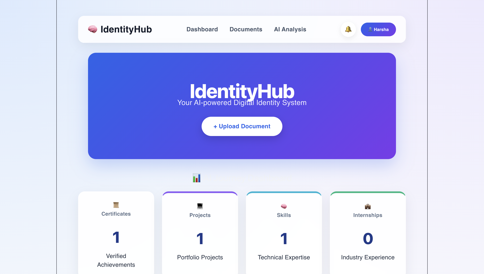
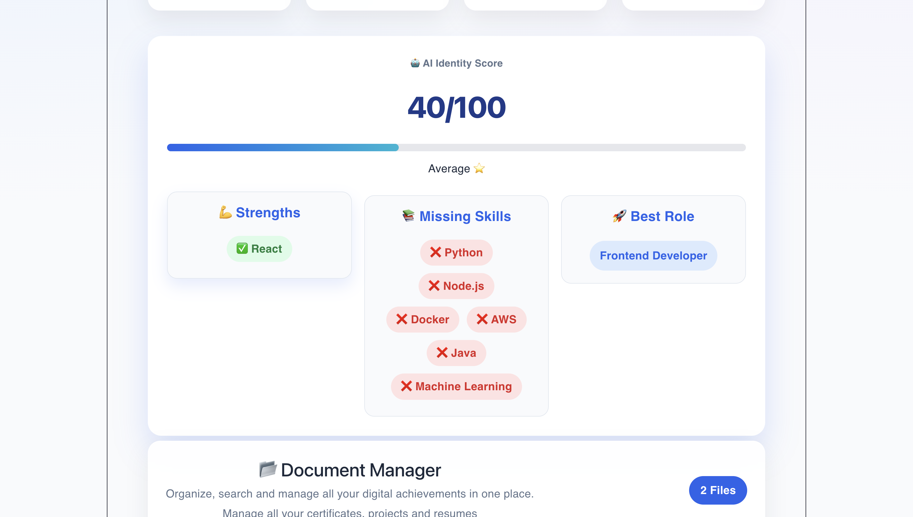
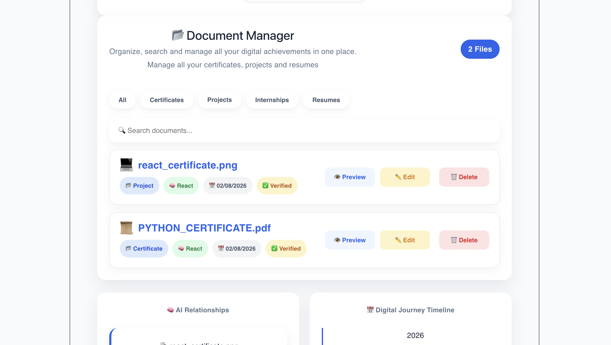

# 🧠 IdentityHub

**IdentityHub** is an AI-powered Digital Identity System that helps students organize, search, and visualize their academic and professional journey.

Instead of storing files in different folders, IdentityHub automatically categorizes uploaded documents, identifies skills, builds relationships, and presents them in an easy-to-understand dashboard.

---

# 🚀 Features

- 📤 Upload certificates and academic documents
- 🤖 AI-powered document categorization
- 🧠 Automatic skill extraction
- 🔍 Smart document search
- 📊 AI Journey Dashboard
- 🔗 AI Relationship Engine
- 📅 Digital Journey Timeline
- ✅ Document verification status

---

# 🛠 Tech Stack

### Frontend
- React
- Vite
- CSS
- Axios

### Backend
- Node.js
- Express.js
- Multer

---

# 📌 Project Workflow

```
Upload Document
        │
        ▼
Backend Upload
        │
        ▼
AI Categorization
(Document Type + Skill + Status)
        │
        ▼
React Dashboard
        │
 ┌──────┼─────────────┐
 ▼      ▼             ▼
Search Relationships Timeline
```

---

# 📸 Screenshots

## 🏠 Home Page



---

## 🤖 AI Identity Score



---

## 📂 Document Manager



# ⚙️ Installation

### Clone Repository

```bash
git clone https://github.com/harshap0/digital-identity-system.git
```

### Frontend

```bash
cd frontend
npm install
npm run dev
```

### Backend

```bash
cd backend
npm install
npm start
```

---

# 🎯 Future Improvements

- OCR for scanned documents
- NLP-based document understanding
- Semantic Search
- Embeddings
- Vector Database
- RAG-powered assistant

---

# 👨‍💻 Developer

**Harsha Patel**

B.Tech CSE (AI & ML)

---

# ⭐ Problem Statement

Students store certificates, resumes, project reports, internship letters, and achievements across multiple folders and cloud drives.

IdentityHub solves this problem by creating an AI-powered digital identity that automatically organizes, categorizes, and connects user information.

---

# 📄 License

This project was developed as a prototype for the **MemoryVerse AI '26 Hackathon**.
